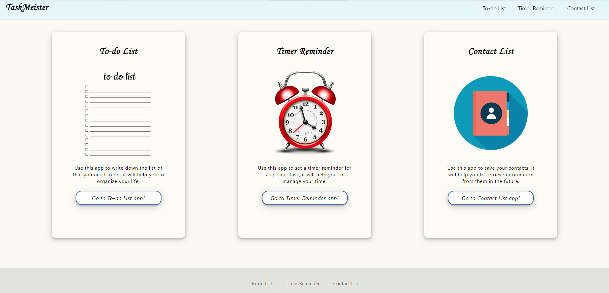
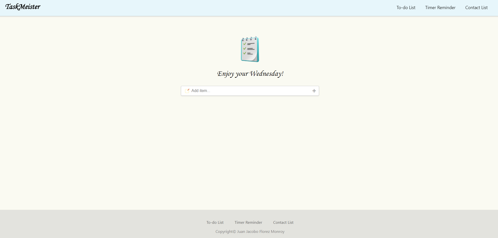
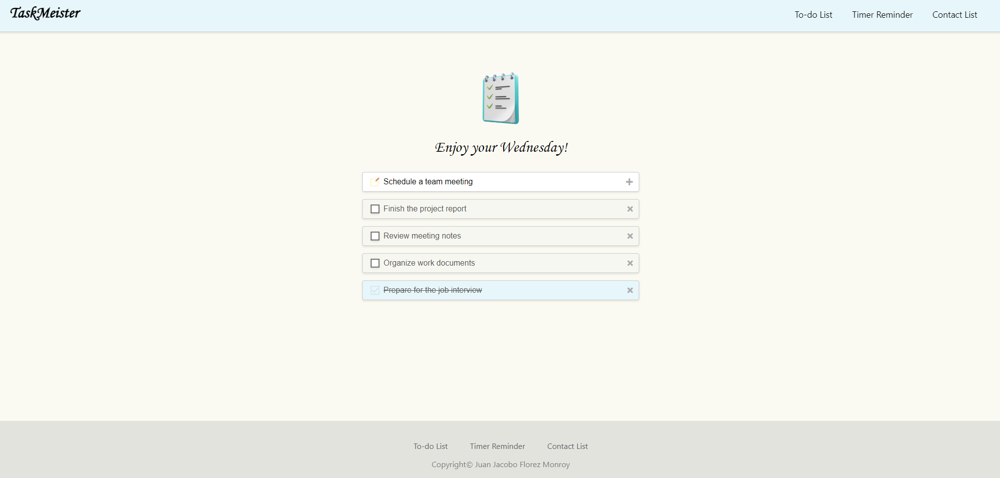
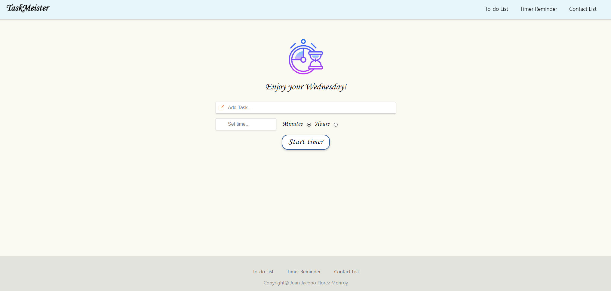
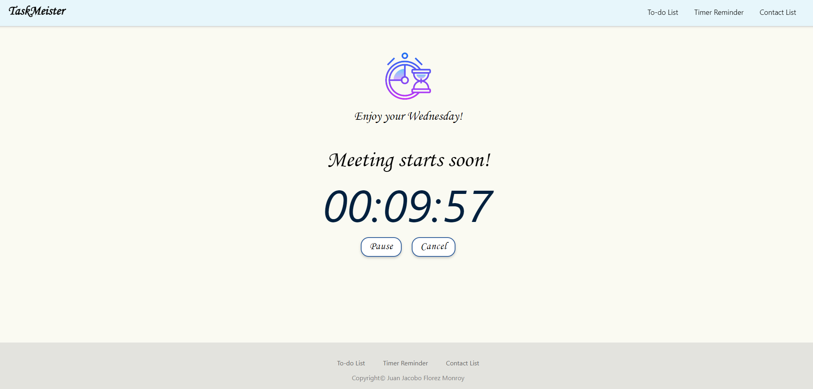
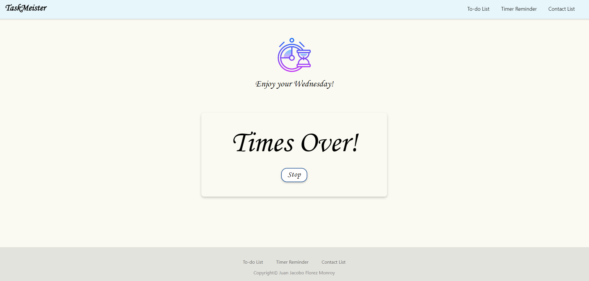
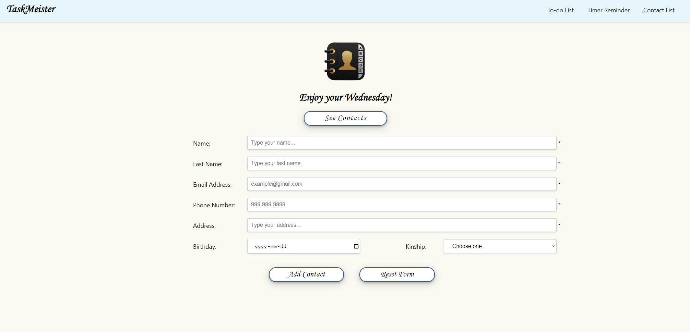
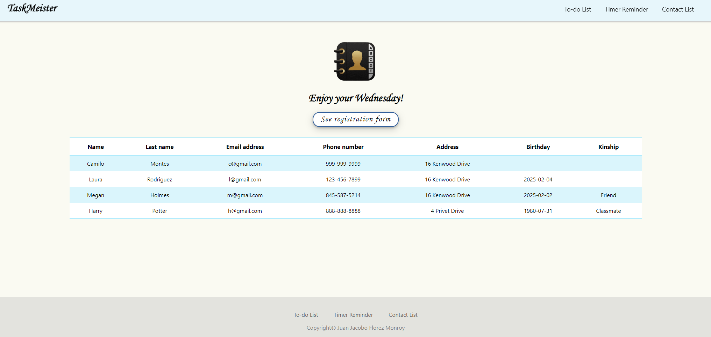

# ✅ TaskMeister - Productivity Web App

## 📌 Project Overview

**TaskMeister** is a productivity web application designed to help users manage their daily activities efficiently. It features an intuitive **To-Do List**, a **Task Timer**, and a **Contact Management System**. This project showcases **JavaScript event handling, DOM manipulation, animations, and responsive design**. It was developed as a **final individual college project** to demonstrate various web development skills.

---

## 🌍 Live Demo

🚀 **Try it out here**: [TaskMeister Live Demo](https://taskmeister-productivity-app.vercel.app)

---

## 🚀 Features

- 📝 **To-Do List**: Add, edit, and remove tasks easily.
- ⏳ **Task Timer**: Set task timers with alarm notifications.
- 📇 **Contact List**: Save and manage contact details.
- 🎭 **Interactive UI**: Includes smooth animations and transitions.
- 📱 **Fully Responsive Design**: Works seamlessly across different screen sizes.

---

## 🛠 Technologies Used

- **HTML5**: Structured markup for content.
- **CSS3**: Styling, layout, and animations.
- **JavaScript (ES6+)**: Handles interactivity and logic.
- **jQuery**: Enhances event handling and animations.

---

## 🎯 Project Purpose

This project was developed as a **college final project** to practice:

- **JavaScript event handling** and **DOM manipulation**.
- **Implementing timers** (`setTimeout`, `setInterval`).
- **Working with animations** and UI interactivity.
- **Building a multi-functional web application**.

---

## 📂 Project Structure

```
📁 taskmeister_project
├── 📁 css/                 # Stylesheets
│   ├── main.css            # Global styles
│   ├── homepage.css        # Home page styles
│   ├── todolist.css        # Styles for the To-Do List
│   ├── tasktimer.css       # Styles for the Task Timer
│   ├── contactlist.css     # Styles for the Contact List
├── 📁 js/                  # JavaScript files
│   ├── homepage.js         # Homepage interactions
│   ├── todolist.js         # To-Do List functionality
│   ├── tasktimer.js        # Task Timer logic
│   ├── contactlist.js      # Contact List management
├── 📁 webpages/            # HTML pages
│   ├── index.html          # Homepage
│   ├── todolist.html       # To-Do List Page
│   ├── tasktimer.html      # Task Timer Page
│   ├── contactlist.html    # Contact List Page
├── 📁 imgs/                # Image assets
├── 📁 audio/               # Alarm sounds for the timer
```

---

## 📌 Prerequisites

To run the project, ensure you have:

- A modern web browser (**Chrome, Firefox, Edge, etc.**).

---

## 🏃‍♂️ How to Use

1️⃣ **Open** `index.html` in a web browser.

2️⃣ **Navigate** through the application using the menu.

3️⃣ **Try each feature**:
   - ✅ **To-Do List**: Add and manage tasks.
   - ⏳ **Task Timer**: Set countdown timers for tasks.
   - 📇 **Contact List**: Store and manage contacts.

---

## 🖼️ Screenshots

| Home 1 | Home 2 |
|-----------|-----------|
|  |  |

| To-do List 1 | To-do List 2 |
|-----------|-----------|
|  |  |

| Task Timer 1 | Task Timer 2 | Task Timer 3 |
|-----------|-----------|-----------|
|  |  |  |

| Contact List 1 | Contact List 2 |
|-----------|-----------|
|  |  |

---

## 📜 License

This project was developed for **educational purposes** as part of a college assignment.

---

## 💼 Author
👤 **Juan Jacobo Florez Monroy**  
🌐 **Portfolio**: [jjacobo95.com](https://jjacobo95.com)  
🐙 **GitHub**: [github.com/jjacoboflorez95](https://github.com/jjacoboflorez95)